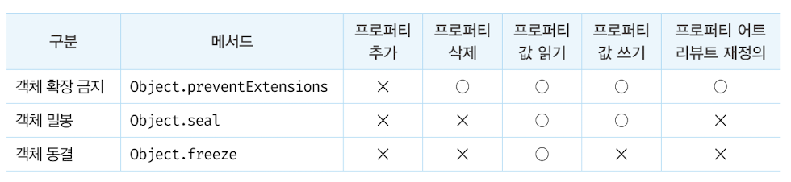

# 04. 객체

**10.** 자바스크립트는 **객체 기반의 프로그래밍** 언어이며, 원시 값을 제외한 모든 값이 객체다!

원시 타입의 값, 원시는 변경 불가능 하다. 하지만 객체 타입의 값, 즉 객체는 변경 가능 하다.

객체는 0개 이상의 **프로퍼티**로 이루어져 있으며, 프로퍼티는 키와 값으로 구성된다.&#x20;

모든 값이 프로퍼티가 될 수 있고, 프로퍼티 값이 함수일 경우 **메서드**(method)라고 부른다!

```javascript
var person = {
    // name: key, 'Hyeonmin': value
    firstName: 'Hyeonmin',
    'last-name': 'Hyeonmin',
    age: 20,
}

// 프로퍼티 접근
console.log(person.firstName);
console.log(person['age']);
console.log(person[age]); // ReferenceError: age is not defined
console.log(person.hobby); // undefined

// Browser vs NodeJs
// Browser: NaN
// NodeJS: ReferenceError: name is not defined
console.log(person.last-name);

// 값 갱신
person.age = 30;

// 생성
person.hobby = 'game';

// 삭제
delete person.hobby;
delete person.gender; // 존재하지 않는 프로퍼티 삭제시에도 오류 X
```

프로퍼티의 키값은 **네이밍 규칙을 지킬 경우 따옴표를 생략** 해줄 수 있다. 반대로 규칙을 지키지 않았다면 따옴표가 필수!

프로퍼티에 접근을 하고 싶다면 ? 마침표 표기법 또는 대괄호 표기법을 사용하면되는데,

대괄호 표기법을 사용할 경우 프로퍼티 키는 반드시 '문자열' 이여야 한다.


console.log(person.last-name); 의 결과가 브라우저와 NodeJs에서 다른 이유가 무엇일까?

자바스크립트 엔진은 먼저 person.last를 평가한다. person.last 는 undefiend로 평가되고,

undefiend에 name은 존재하지 없으니 참조 에러를 발생한다.

하지만 브라우저에서는 name이라는 전역 변수 (window의 프로퍼티)가 존재한다. 전역 변수 name은

(window)의 이름을 가리키며 빈 문자열이므로 NaN이 출력된다.



**11.** 객체를 한번 살펴 보려고한다. **원시 타입**과 **객체 타입**으로 나누어져 있다.

원시 타입은 값을 변경 할 수 없다. 원시 값을 변수에 할당하면 메모리에는 실제 값이 저장이 된다.

값을 변경 할 수 없다는 것은 원시 값을 변경하지 못한다는 뜻이지 변수 값을 변경 할 수 없다는건 아니다.

<figure><figcaption><p>원시값 재할당</p></figcaption></figure>

```javascript
var score = 80;
var copy = score;

console.log(score, copy); // 80, 80

score = 100;

console.log(score, copy); // 100, 80
```

위의 코드와 같이 `var copy = score;` 실행시 메모리에선 어떤식으로 관리를 할까?

<figure><figcaption></figcaption></figure>

.

.

우리가 많이 사용하는 **객체**는 프로퍼티의 개수도 정해져 있지 않고, 동적으로 추가되며 삭제 된다.

그렇기 때문에 얼만큼의 공간을 확보해야 하는지 알기 어렵다.


자바나 C++같은 객체 지향 언어는 사전에 정의된 클래스로 인스턴스를 생성한다.&#x20;

하지만 자바스크립트는 객체가 생성된 후에도 프로퍼티와 메서드를 추가할 수 있는데,&#x20;

이는 생성과 프로퍼티 접근에 많은 비용이 드는 단점이 있다.&#x20;

따라서 V8에서는 프로퍼티에 접근하기위해 [**히든 클래스**](https://engineering.linecorp.com/ko/blog/v8-hidden-class) 라는 방식을 사용한다.


<figure><figcaption></figcaption></figure>

위의 그림은 객체 타입이 메모리에 어떤식으로 저장되어 있는지 보여준다.

아까 봤던 값이 그대로 메모리에 저장되었던 원시 타입과는 다르게 var person 은 값을 **참조하는 메모리 주소**를

가지고 있다. 이는 수정시에도 새로운 메모리 공간을 확보하는게 아니라 참조중인 주소에 값을 새로 넣는다.

```javascript
ver person = {name: 'LEE'};
var copy = person;
```

<figure><figcaption></figcaption></figure>

위의 사진을 참고해 보면 한가지 문제점이 있다. 원시 타입과는 다르게 값이 아닌 참조하고 있는 위치를 가지게 된다.

이는 person과 copy가 같은 값을 참조하고 있고, 우리는 둘 중 하나의 값을 수정했을 경우 두 변수 모두에게 영향을

주게 된다. -> 그래서 리액트에서 객체를 복사할때 '깊은 복사'를 자주 만나게 된다. 😅
